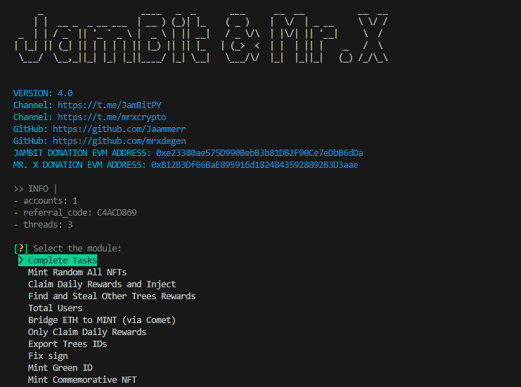

# MintChain Daily Bot


 


## 🔗 Links

🔔 CHANNEL: https://t.me/JamBitPY

💬 CHAT: https://t.me/JamBitChat

💰 DONATION EVM ADDRESS: 0xe23380ae575D990BebB3b81DB2F90Ce7eDbB6dDa


## 🤖 | Features:

- **Auto registration**
- **Auto bind referral**
- **Auto bind twitter**
- **Auto collect all possible rewards (boxes, energy)**
- **Auto spin turntable**
- **Auto inject**
- **Auto bridge from SEPOLIA to MINT (testnet)**
- **Auto completing tasks**


## 📝 | Description:
```Auto bridge from SEPOLIA to MINT (testnet)```
```- The script will bridge a random amount of ETH from SEPOLIA to MINT (testnet).```

```Auto completing tasks```
```- The script will complete all twitter tasks and testnet```


## 🚀 Installation
`` Required python >= 3.10``

``1. Close the repo and open CMD (console) inside it``

``2. Install requirements: pip install -r requirements.txt``

``3. Setup configuration and accounts``

``4. Run: python run.py``


## ⚙️ Config (config > settings.yaml)

| Name    | Description                                                                                                                                                |
|---------|------------------------------------------------------------------------------------------------------------------------------------------------------------|
| referral_code | Your referral code                                                                                                                                         |
| eth_rpc_url | ETH RPC URL (if not have, leave the default value)                                                                                                         |
| sepolia_rpc_url | SEPOLIA RPC URL (if not have, leave the default value)                                                                                                     |
| threads | Number of accounts that will work simultaneously                                                                                                           |
| min_delay_before_start | min delay before start accounts actions (in seconds)                                                                                                       |
| max_delay_before_start | max delay before start accounts actions (in seconds)                                                                                                       |
| min_amount_to_bridge | min amount of ETH to bridge from SEPOLIA to MINT                                                                                                           |
| max_amount_to_bridge | max amount of ETH to bridge from SEPOLIA to MINT                                                                                                           |
| spin_turntable_by_percentage_of_energy | percentage of balance that will be spent on spins (for example, if you have 500 energy daily and you bet 60%, the script will make 1 spin on your account) |
| shuffle_accounts | shuffle accounts before start                                                                                                                              |


## ⚙️ Accounts format (config > accounts.txt)

- twitter_auth_token|wallet_mnemonic|proxy

`` Proxy format: IP:PORT:USER:PASS``
